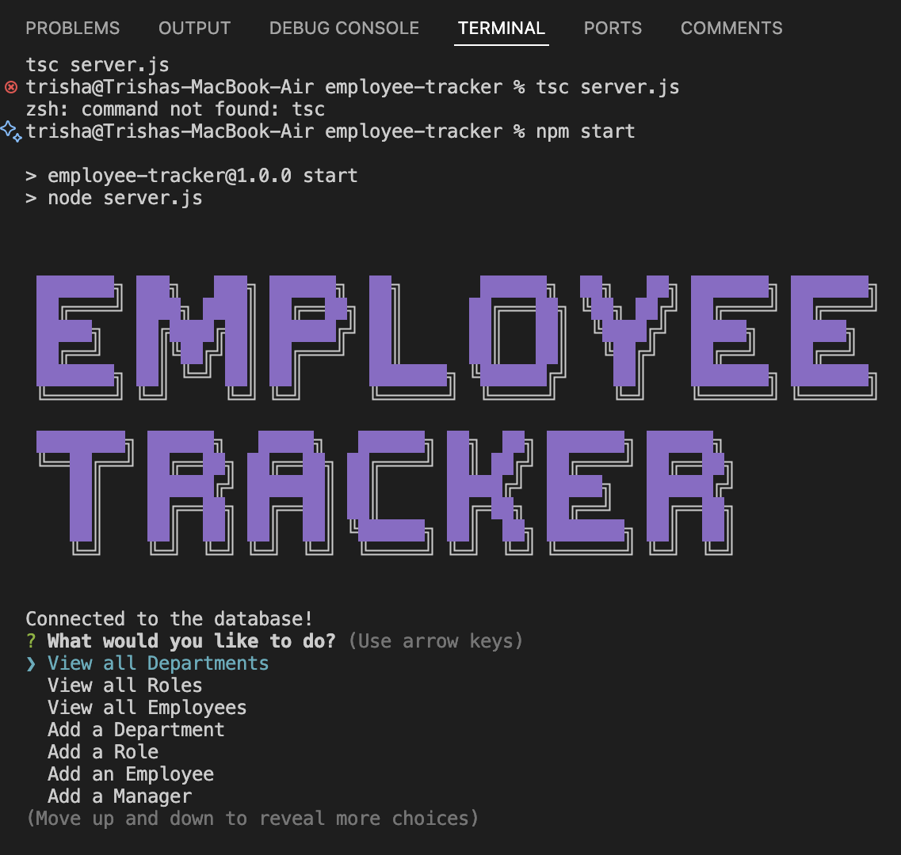
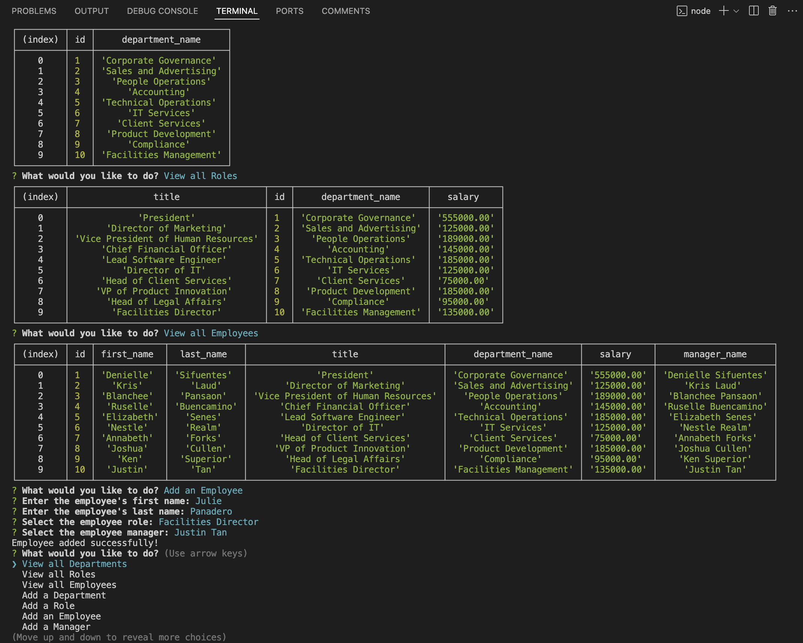
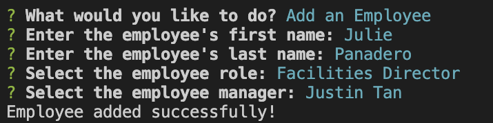
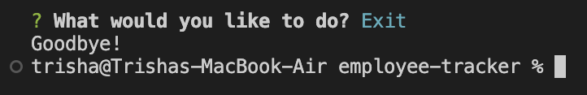

# 📋 Employee Tracker

[](https://github.com/trishamasbate)
[](https://choosealicense.com/licenses/mit/)


## ✏️ Description

**The Employee Tracker** is designed for business owners who need to effectively view and manage their company's departments, roles, and employees. It facilitates organization and business planning by providing an intuitive interface for data management.

It is tailored to meet the following criteria:

- **User Interaction:** Upon starting the application, users are presented with options to view all departments, roles, employees, add a department, role, employee, and update an employee's role.
- **View Departments:** Displays a formatted table with department names and IDs.
- **View Roles:** Shows job titles, role IDs, associated departments, and salaries.
- **View Employees:** Provides a formatted table with employee IDs, names, job titles, departments, salaries, and reporting managers.
- **Add Department:** Prompts for and records a new department name.
- **Add Role:** Prompts for and records a new role name, salary, and associated department.
- **Add Employee:** Prompts for and records an employee's first name, last name, role, and manager.
- **Update Employee Role:** Prompts to select an employee and update their role in the database.

## 📌 Table of Contents
- [📋 Employee Tracker](#-employee-tracker)
  - [✏️ Description](#️-description)
  - [📌 Table of Contents](#-table-of-contents)
  - [🔎 User Story](#-user-story)
  - [✅ Acceptance Criteria](#-acceptance-criteria)
  - [📲 Installation Process (GitHub Repository)](#-installation-process-github-repository)
  - [🎞️ Walkthrough Video:](#️-walkthrough-video)
  - [📸 Screenshots:](#-screenshots)
    - [🟢 Welcome Page](#-welcome-page)
    - [🟢 View Options](#-view-options)
    - [🟢 Add Options](#-add-options)
    - [🟢 Termination](#-termination)
  - [🗝️ Resources](#️-resources)
  - [❓ Questions](#-questions)
  - [🪪 License](#-license)

## 🔎 User Story
```md
AS A business owner
I WANT to be able to view and manage the departments, roles, and employees in my company
SO THAT I can organize and plan my business
```

## ✅ Acceptance Criteria
```md
GIVEN a command-line application that accepts user input
WHEN I start the application
THEN I am presented with the following options: view all departments, view all roles, view all employees, add a department, add a role, add an employee, and update an employee role
WHEN I choose to view all departments
THEN I am presented with a formatted table showing department names and department ids
WHEN I choose to view all roles
THEN I am presented with the job title, role id, the department that role belongs to, and the salary for that role
WHEN I choose to view all employees
THEN I am presented with a formatted table showing employee data, including employee ids, first names, last names, job titles, departments, salaries, and managers that the employees report to
WHEN I choose to add a department
THEN I am prompted to enter the name of the department and that department is added to the database
WHEN I choose to add a role
THEN I am prompted to enter the name, salary, and department for the role and that role is added to the database
WHEN I choose to add an employee
THEN I am prompted to enter the employee’s first name, last name, role, and manager, and that employee is added to the database
WHEN I choose to update an employee role
THEN I am prompted to select an employee to update and their new role and this information is updated in the database
```

## 📲 Installation Process (GitHub Repository)
1. Clone the repository: [Employee Tracker](https://github.com/trishamasbate/employee-tracker)
2. Open via Visual Studio Code or an editor of your choice.
3. Run the terminal.
4. Install the following:
   
   - Node.js [Version 20.14.0](https://nodejs.org/en/blog/release/v20.14.0/) 
   - PG Package [Version 8.12.0](https://www.npmjs.com/package/pg)
   - Inquier.js [Version 8.2.4](https://www.npmjs.com/package/inquirer/v/8.2.4)
   - cfonts [Version 3.3.0](https://www.npmjs.com/package/cfonts)
   - dotenv [Version 16.4.5](https://www.npmjs.com/package/dotenv)

5. Initialize the PostgreSQL database using the provided schema and seed data.
6. Modify the database configuration in the `server.js` file with your PostgreSQL credentials.
7. Open the integrated terminal and complete the installation steps outlined in section (2) to ensure the cloned documentation functions properly. These can also be downloaded by typing in `npm install` in the terminal.
8. Launch the application with `npm start` and follow the on-screen instructions to view and manage your company’s departments, roles, and employees.

## 🎞️ Walkthrough Video:
[Click To See Some Magic!](https://youtu.be/WIW7-shk1dc?si=bhHRTt7HfAKoH6fb)

## 📸 Screenshots:
### 🟢 Welcome Page

### 🟢 View Options

### 🟢 Add Options

### 🟢 Termination


## 🗝️ Resources
- Dynamic JavaScript
- License Badge: [Shields.io](https://shields.io/)
- [Visual Studio Code](https://code.visualstudio.com/)
- [Node.js](https://nodejs.org/en/blog/release/v20.14.0/) 
- [PG Package](https://www.npmjs.com/package/pg)
- [Inquier.js](https://www.npmjs.com/package/inquirer/v/8.2.4)
- [cfonts](https://www.npmjs.com/package/cfonts)
- [dotenv](https://www.npmjs.com/package/dotenv)


## ❓ Questions
Contact the author with any questions!<br>
Github link: [trishamasbate](https://github.com/trishamasbate)<br>
Email: trisha.masbate@gmail.com

## 🪪 License
This project is [MIT](https://choosealicense.com/licenses/mit/) licensed.<br />

Copyright © 2024 [TRISHA MASBATE](https://github.com/trishamasbate)
  
<hr>
<p align='center'><i>
All the best! 🤟🏻 TRISHA MASBATE
</i></p>
  
